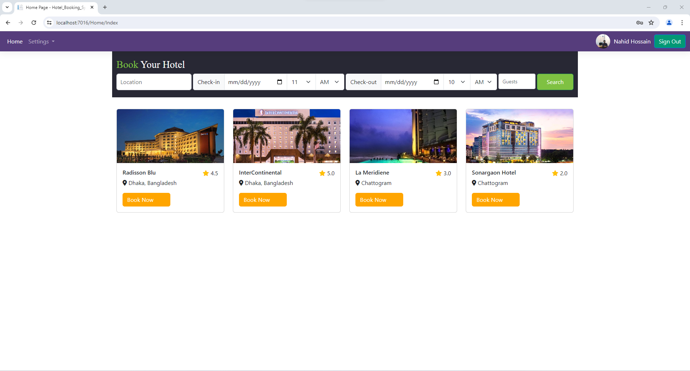
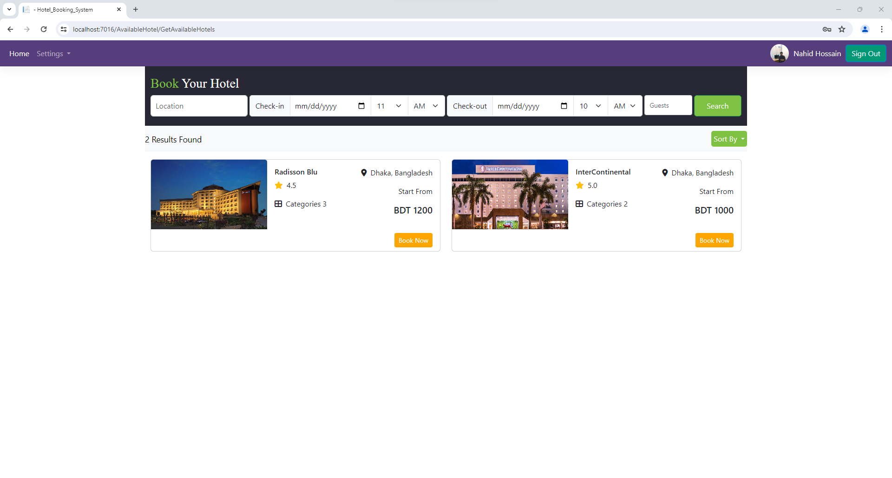
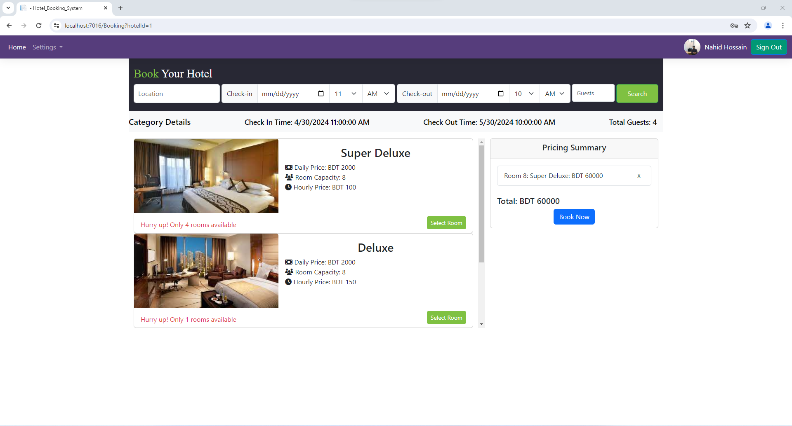
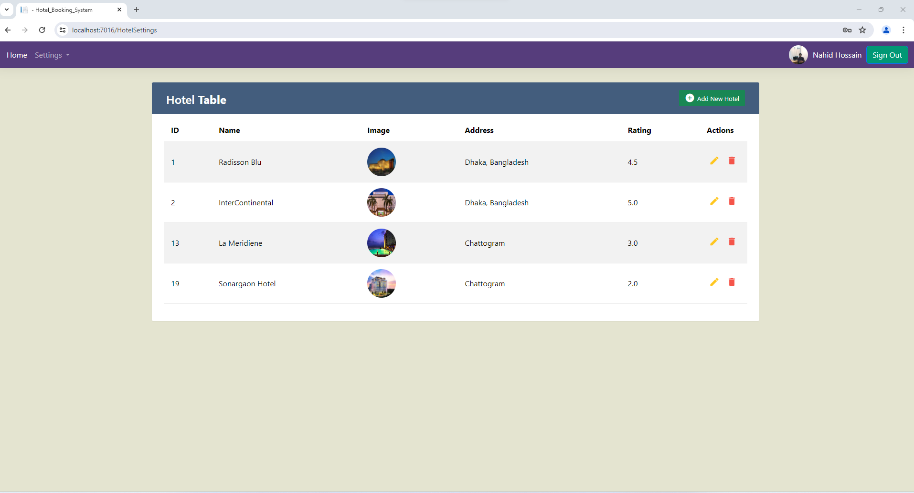

# Online Hotel Booking System

## Overview
The Online Hotel Booking System is a web application developed using .NET Core 6 MVC framework. It allows users to search, view, and book hotels. The application includes features such as searching for available hotels, viewing hotel details, and booking rooms with different pricing options.

## Features
- **Hotel Search**: Search for hotels based on location and date.
- **Hotel Listing**: Display a list of available hotels with ratings and details.
- **Room Booking**: Book rooms with different categories and pricing options.
- **Admin Panel**: Add Hotel, Room Category, Room

## Screenshots

### Home Page

### Available Hotels

### Booking Details

### Admin Panel

## Prerequisites
- [.NET Core 6 SDK](https://dotnet.microsoft.com/download/dotnet/6.0)
- [Visual Studio 2022](https://visualstudio.microsoft.com/vs/)
- [SQL Server](https://www.microsoft.com/en-us/sql-server/sql-server-downloads)
